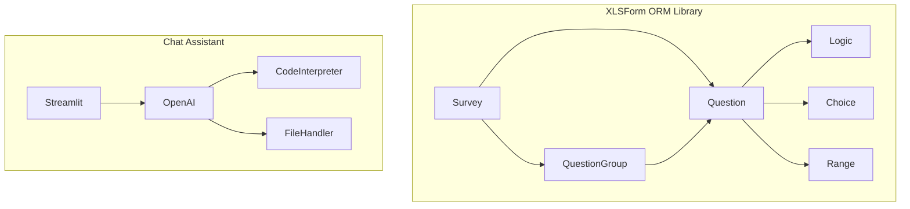
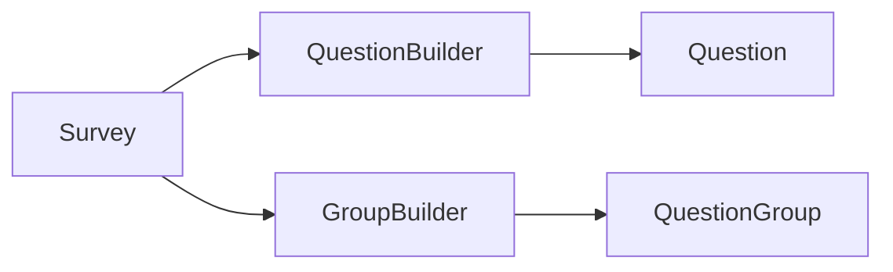
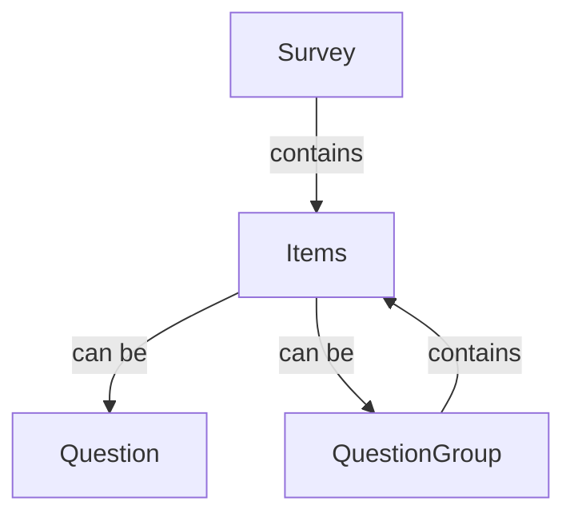
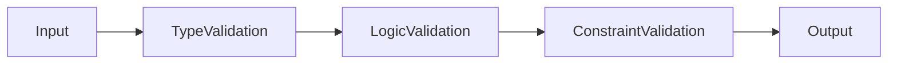
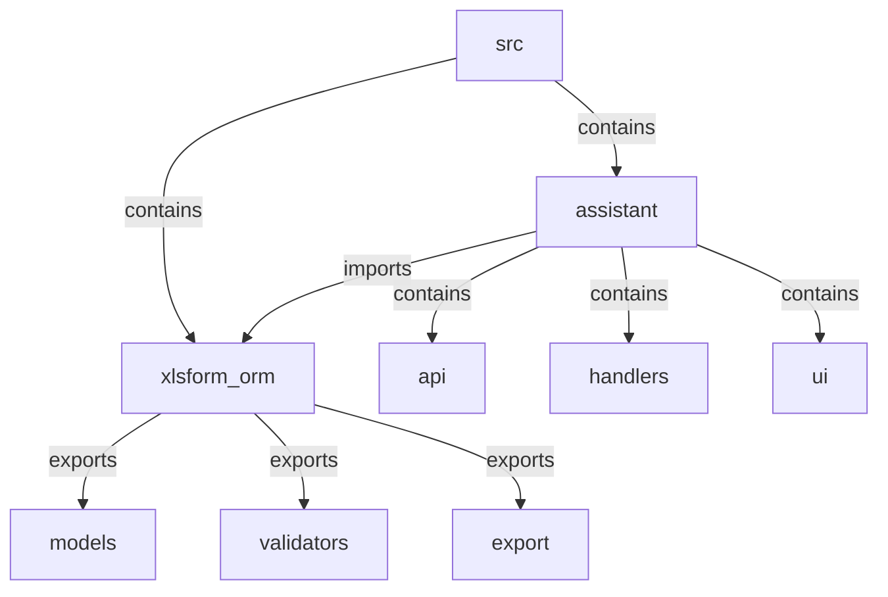
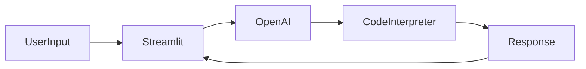
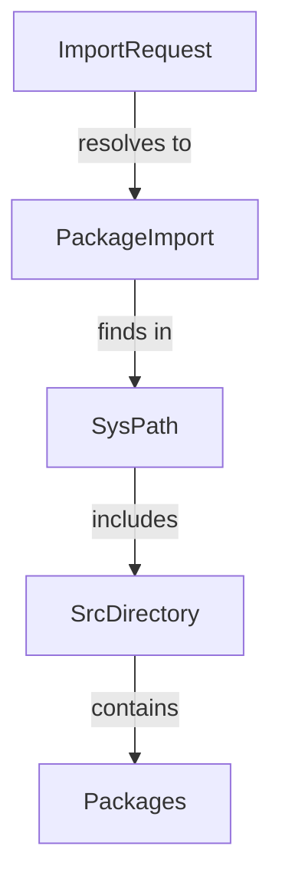

# System Patterns

## Architecture Overview

## Core Components

### XLSForm ORM Library

#### Base Models
1. **Survey**
   - Top-level container for form structure
   - Manages questions and groups
   - Handles Excel export/import
   - Provides YAML serialization

2. **Question**
   - Represents individual form questions
   - Supports multiple question types
   - Handles validation and constraints
   - Manages appearance attributes

3. **QuestionGroup**
   - Organizes related questions
   - Supports nested groups
   - Handles group-level logic
   - Manages repeat groups

4. **Supporting Models**
   - **Logic**: Flow control and constraints
   - **Choice**: Multiple choice options
   - **Range**: Numeric range parameters

### Chat Assistant

#### Components
1. **Streamlit Interface**
   - Manages user interaction
   - Handles session state
   - Displays chat messages
   - Manages file operations

2. **OpenAI Integration**
   - Processes user input
   - Generates responses
   - Handles code interpretation
   - Manages file context

## Design Patterns

### 1. Object-Relational Mapping
- Maps XLSForm concepts to Python objects
- Uses Pydantic for validation
- Provides clean API for form manipulation
- Enables type safety and IDE support

### 2. Builder Pattern

### 3. Composition Pattern

### 4. Factory Methods
- `Survey.parse_excel()`: Creates Survey from Excel
- `Survey.parse_yaml()`: Creates Survey from YAML
- `items_to_dfs()`: Creates DataFrames from items

### 5. Validation Chain

### 6. Package Structure

## Data Flow

### Survey Creation

### Chat Interaction

### Import Resolution

## Error Handling
1. **Type Validation**
   - Pydantic models enforce types
   - Custom validators for complex rules
   - Clear error messages

2. **Logic Validation**
   - Question type compatibility
   - Group structure validation
   - Logic expression validation

3. **Chat Error Handling**
   - Retry mechanism for API calls
   - Error state management
   - User-friendly error messages

4. **Import Error Handling**
   - Path management in __init__.py files
   - Fallback mechanisms for imports
   - Clear error messages for import failures

## Best Practices
1. **Code Organization**
   - Clear class hierarchy
   - Separation of concerns
   - Modular design
   - Proper package structure

2. **Validation**
   - Early validation
   - Strong typing
   - Clear error messages

3. **Documentation**
   - Comprehensive docstrings
   - Usage examples
   - Type hints

4. **Testing**
   - Unit tests for components
   - Integration tests for workflows
   - Example-based testing

5. **Import Management**
   - Use relative imports within packages
   - Ensure src directory is in Python path
   - Maintain clear package boundaries
   - Document import patterns
